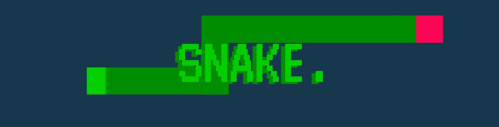
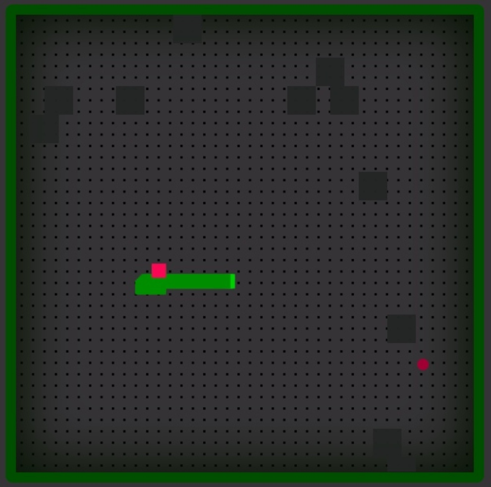

____
#Snake.
##  Установка
Для предосмотра работы "сайта" перейдите на [github pages](https://www.google.com "клик😜"). 
>⚠️ Рекомендуется установить игру локально (или на сервер), для корректной работы и устранения некоторых задержек.

Для локальной установки 
1. [скачайте архив](https://github.com/doctored11/SnakeJs.github.io/archive/refs/heads/main.zip "да - это ссылка на архив прямо с github")
2. распакуйте его в любую папку
3. запустите файл index.html
4. у вас откроется окно браузера с игрой
5. нажмите на f11 и наслаждайтесь
___
## Игровые моменты
1. Управление на WASD
2. Для победы нужно набрать 333 очка
3. Режим на двоих активируется на нажатие стрелок на клавиатуре, важно чтобы счет первого игрока был меньше единицы
____
 ### Игровые странности
 1. На поле нет стен, змей может обойти карту
 2. Если вы "родились" в камне - это не баг, это жизнь такая
 3. Если камень во время игры "упал" на вас и убил - это не баг, это жизнь такая
 4. Если вам негде развернуться и вы боитесь укусить свое же тело, то вы можете попробовать один игровой трюк - проползти над своим телом, для этого нажмите на кнопку противоположную вашему движению(ползете влево, нажимаете "A").
 
  
5. И помните дети, не ешьте чужие какашки - это может плохо кончится💩

